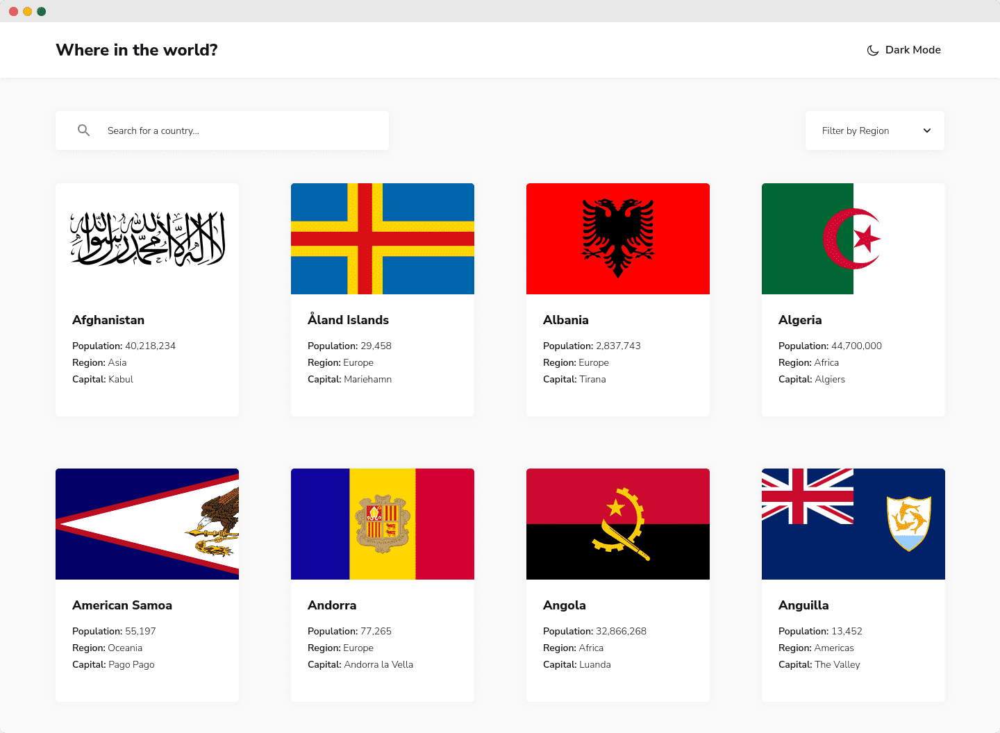
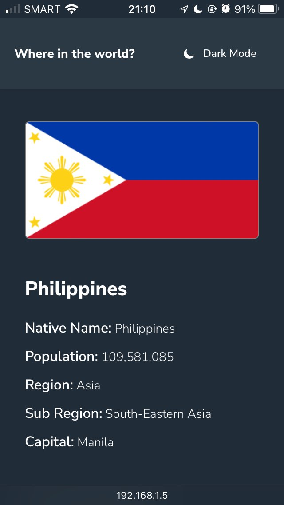

# Frontend Mentor - REST Countries API with color theme switcher solution (v2)

This is my updated solution to the [REST Countries API with color theme switcher challenge on Frontend Mentor](https://www.frontendmentor.io/challenges/rest-countries-api-with-color-theme-switcher-5cacc469fec04111f7b848ca).

(For the original solution, [see the main branch](https://github.com/joshjavier/rest-countries-api/tree/main).)

## Table of contents

- [Overview](#overview)
  - [The challenge](#the-challenge)
  - [Screenshots](#screenshots)
  - [Links](#links)
- [My process](#my-process)
  - [Built with](#built-with)
  - [What I learned](#what-i-learned)
  - [Useful resources](#useful-resources)
- [Author](#author)
<!-- - [Acknowledgments](#acknowledgments) -->

## Overview

### The challenge

Users should be able to:

- [x] See all countries from the API on the homepage
- [x] Search for a country using an `input` field
- [x] Filter countries by region
- [x] Click on a country to see more detailed information on a separate page
- [x] Click through to the border countries on the detail page
- [x] Toggle the color scheme between light and dark mode *(optional)*

### Screenshots





### Links

- Solution URL: https://www.frontendmentor.io/solutions/rest-countries-api-with-dark-mode-ft-react-ts-query-router-parcel-xr6V2iK_5C
- Live Site URL: https://rest-countries-api-16m.pages.dev/

## My process

### Built with

- [Parcel](https://parceljs.org/) - zero config build tool
- [React](https://react.dev/) & [TypeScript](https://www.typescriptlang.org/)
- [React Router](https://reactrouter.com/) - client-side routing
- [TanStack Query](https://tanstack.com/query) - formerly known as React Query, used for data fetching and caching
- [Axios](https://axios-http.com/) - Promise-based HTTP client
- [REST Countries v3.1](https://restcountries.com/) - The Data Source
- [React Content Loader](https://skeletonreact.com/) - skeleton loaders

### What I learned

First of all, **I love Parcel. It Just Works&trade;**

I've been using Lightning CSS in my recent projects, but Vite uses PostCSS (by default). So, since Lightning CSS is made by the creator of Parcel, I finally decided to give it a try. And I'm glad I did.

True to its name, Parcel works with zero or minimal config. Want to use TypeScript? Use a `<script>` tag with the `src` attribute pointing to a `.tsx` file&mdash;it just works. Need to use SVG as a React component? Import it inside a component module&mdash;it just works.

That said, I did find some things that are lacking, like Storybook support. [According to this GitHub issue](https://github.com/parcel-bundler/parcel/issues/3321), seems like Parcel support for Storybook isn't coming anytime soon. 😔

For this project, Parcel is still a good fit due to its ease of use, especially since the components aren't that complex.

**Bye, theme flicker**

[My original solution](https://whereintheworld-88.netlify.app/) flickers on page load from a blank white page, then to dark mode. This is because the logic for detecting the user's theme preference is located in the `<DarkModeToggle />` component, so only after React is loaded does the theme kick in.

In this updated solution, I solved the theme flicker issue by placing a script tag in the `<head>` which detects the user's theme preference and sets it as early as possible before styles are even applied. Generally, blocking JavaScript is bad, but in this case the code is relatively small and greatly enhances UX, so it's a fair tradeoff.

```ts
type Theme = 'light' | 'dark'

window.getThemePreference = (key = 'theme-preference'): Theme => {
  const themePreference = localStorage.getItem(key)
  if (typeof themePreference === 'string') {
    return themePreference as Theme
  } else {
    return window.matchMedia('(prefers-color-scheme: dark)').matches
      ? 'dark'
      : 'light'
  }
}

window.reflectThemeChange = () => {
  document.documentElement.setAttribute('data-theme', getThemePreference())
}

// Set the `data-theme` attribute early to prevent page flashes
reflectThemeChange()
```

The rest of the theme switch functionality, such as user toggle and automatic switching when `prefers-color-scheme` changes (e.g., when the user switches their device from light to dark mode and vice versa) is offloaded to the `<ThemeSwitch />` component.

**Be lazy (when loading images)**

There are 250 countries in the REST Countries API, but only eight is visible initially (if you're using desktop). Loading all 250 images of each country's flag would waste the user's bandwidth, so I added the `loading="lazy"` attribute to the image tags in the homepage.

**Caching data with ~~React~~ TanStack Query**

Using React Query for data fetching out of the box speeds up subsequent page loads since it uses the cache. However, it still does a background refetch every time a user navigates to a page. Since the data we're dealing with doesn't change as often, I set a longer stale time so the same data will only be refetched after five minutes.

```js
const { isPending, isError, data, error } = useQuery({
  queryKey: ['countries'],
  queryFn: getCountries,
  staleTime: 5 * 60 * 1000, // fetched data is fresh for 5 minutes
})
```

**From TypeScript noob to TypeScript enthusiast**

It's been a year since my first attempt at this challenge, and I think I've learned quite a bit about TypeScript to appreciate its value for developers: the peace of mind that your code will do what you expect it to do.

My favorite feature is hovering over variables and functions in VS Code to see types, parameters, etc. This greatly helps my thinking and speeds up my workflow; sometimes, instead of checking out a documentation site, I find that I can figure out what to do simply by looking at a function's parameter and return types.

<!-- ### Continued development

Use this section to outline areas that you want to continue focusing on in future projects. These could be concepts you're still not completely comfortable with or techniques you found useful that you want to refine and perfect.

**Note: Delete this note and the content within this section and replace with your own plans for continued development.** -->

### Useful resources

- [Building a theme switch component](https://web.dev/articles/building/a-theme-switch-component)
- [Essential TypeScript 5, Third Edition](https://www.manning.com/books/essential-typescript-5-third-edition) and [Effective TypeScript](https://effectivetypescript.com/) - The first book helped me grasp the foundational concepts of TypeScript. I'm currently reading through the second one and discovering deeper insights on the subject.

## Author

- Website - [Josh Javier](https://joshjavier.com)
- Frontend Mentor - [@joshjavier](https://www.frontendmentor.io/profile/joshjavier)
- Twitter - [@joshjavierr](https://www.twitter.com/joshjavierr)
- LinkedIn - [Josh Javier](https://www.linkedin.com/in/joshjavier)

<!-- ## Acknowledgments

This is where you can give a hat tip to anyone who helped you out on this project. Perhaps you worked in a team or got some inspiration from someone else's solution. This is the perfect place to give them some credit.

**Note: Delete this note and edit this section's content as necessary. If you completed this challenge by yourself, feel free to delete this section entirely.** -->
